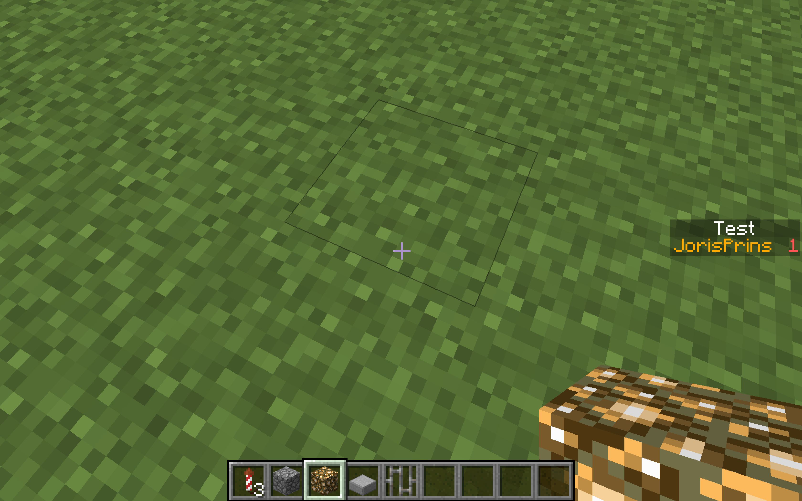

**How to use *scoreboard* command**

- First enter: /scoreboard objectives add {A name for the scoreboard}    
- You now have a scoreboard, but you can't see it.  
- You can make this visible by this command:  
- /scoreboard objectives setdisplay sidebar {the name of your scoreboard}      
- After that do this
-/scoreboard players add {playername} 1  

Now you have add the player and set the score to 1

  
